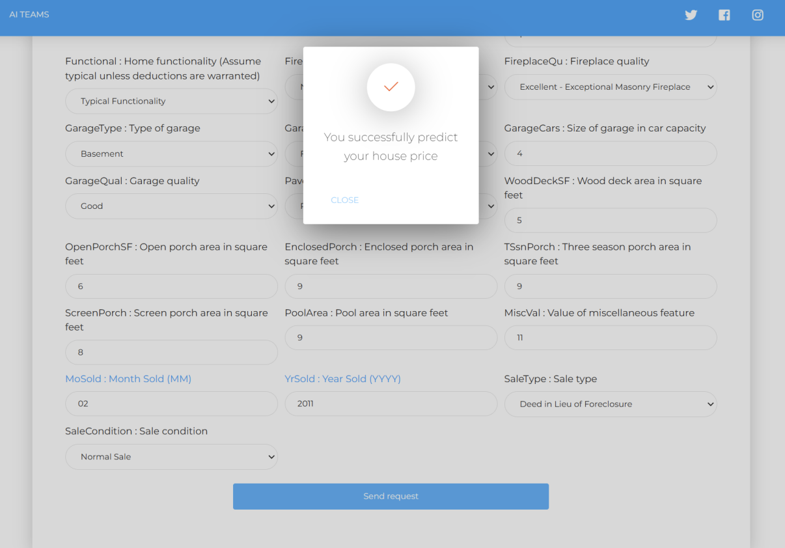
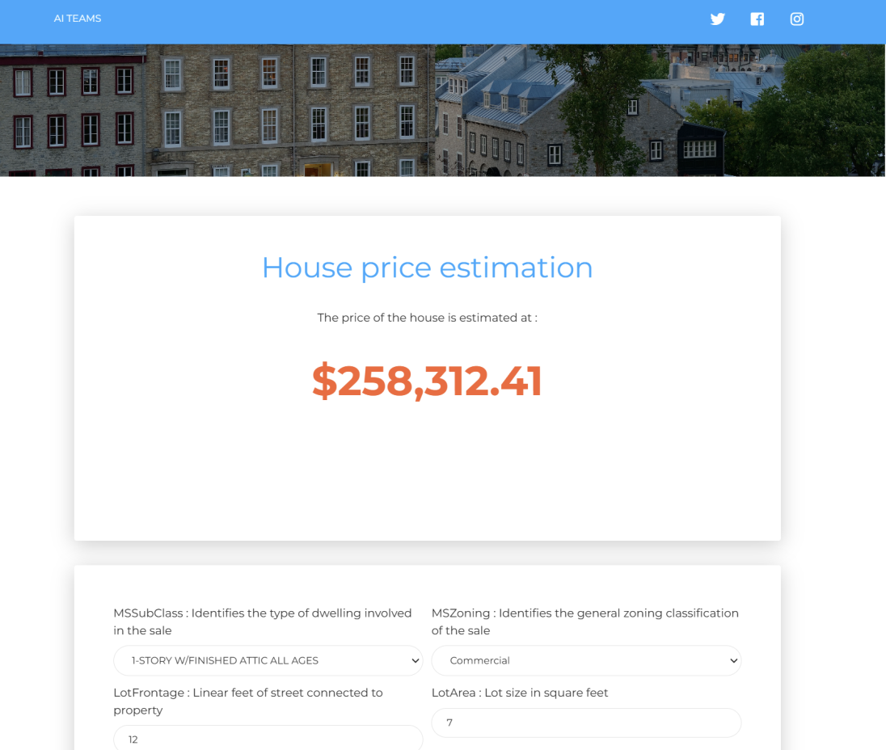

# 🚀 Prédiction des Prix de l'Immobilier / Real Estate Price Prediction


## Description du Projet / Project Description
Ce projet vise à prédire les prix de vente de biens immobiliers en utilisant des techniques avancées de régression, y compris l'ingénierie des caractéristiques et le gradient boosting. Conçu pour la compétition [House Prices - Advanced Regression Techniques](https://www.kaggle.com/c/house-prices-advanced-regression-techniques) sur Kaggle, ce projet m'a permis d'atteindre le **Top 600** des classements.

This project aims to predict real estate sale prices by applying advanced regression techniques, feature engineering, and gradient boosting. Developed for the [House Prices - Advanced Regression Techniques](https://www.kaggle.com/c/house-prices-advanced-regression-techniques) competition on Kaggle, this project helped me achieve a **Top 2000** ranking.

**Technologies utilisées :** Python, Machine Learning, Auto-encodeurs, Régression, XGBoost, Flask, ReactJS.  
**Compétences mises en place :**
- Nettoyage des données et traitement des valeurs manquantes.
- Utilisation d'un autoencodeur pour éliminer les anomalies dans le dataset.
- Application de modèles de régression (Linear Regression, Ridge, Random Forest, XGBoost) et d'algorithmes d'ensemble (Voting Regressor, Stacking Regressor).
- Développement d'une interface web avec ReactJS et Flask pour interagir avec le modèle prédictif.


## Captures d'Écran / Screenshots

### Interface Utilisateur / User Interface


*Description de l'image : Interface permettant aux utilisateurs de saisir les caractéristiques d'une maison pour en prédire le prix.*



*Description de l'image : Prédiction du prix d'une maison en fonction de ses caractéristiques.*


## Dataset
- **Source** : [House Prices - Advanced Regression Techniques](https://www.kaggle.com/c/house-prices-advanced-regression-techniques)
- **Description** : Données de caractéristiques de biens immobiliers, utilisées pour entraîner et évaluer des modèles de régression. / Real estate feature data for training and evaluating regression models.

## Interface
Permet aux utilisateurs de saisir les caractéristiques d'une maison pour en prédire le prix.

Allows users to input home features to predict the property's price.

## Langage / Language
**Python**

## Feuille de Route / Roadmap
- [12/11/2024] : Choix du sujet / Topic Selection

## Installation

Clonez le dépôt GitHub et installez les dépendances.

Clone the GitHub repository and install dependencies.

```bash
git clone https://github.com/MathisAulagnier/real_estate_prediction.git
cd real_estate_prediction
pip install -r requirements.txt
```
Utilisation / Usage

Exécutez data_preprocessing.py pour préparer les données, model_training.py pour entraîner le modèle, puis prediction.py pour faire des prédictions.

Run data_preprocessing.py to prepare the data, model_training.py to train the model, and prediction.py to make predictions.

Structure du Projet / Project Structure

- data_preprocessing.py : Prétraitement des données. / data_preprocessing.py: Data preprocessing.
- model_training.py : Entraînement du modèle.  / model_training.py: Model training.
- prediction.py : Prédiction des prix.  / prediction.py: Price prediction.


